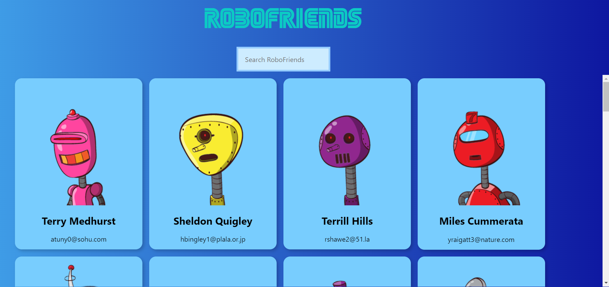
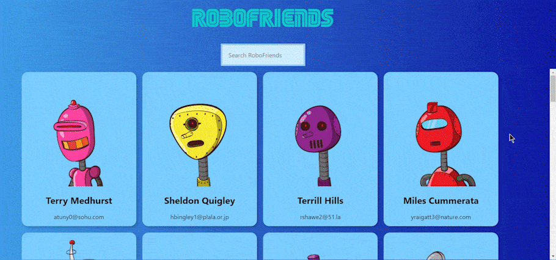
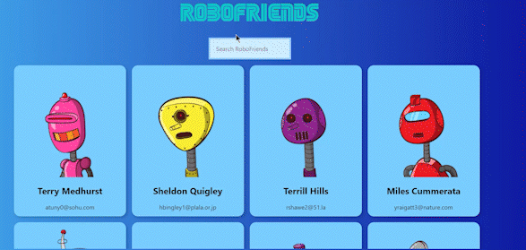
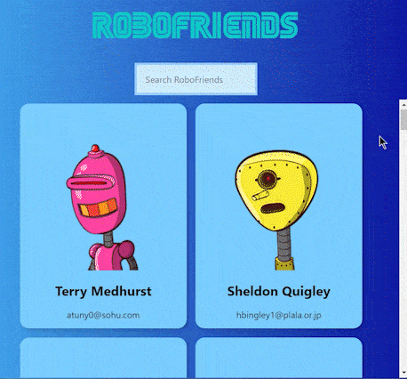

<h1 align='center'>RoboFriends App 
  Live Site: https://profoundlyparker.github.io/RoboFriends/
</h1>

This is a Zero to Mastery Complete Web Developer's course project. I've added React Hooks + Redux + Jest to this project and made some style changes. I also chose to use a more complex API than the course did. 
DummyJSON data: <a href='https://dummyjson.com/users'>DummyJSON API</a> 
JSON Placeholder data used in ZTM course: <a href='https://jsonplaceholder.typicode.com/users'>JSON Placeholder API</a>

## Description

A React app that uses DummyJSON API to display robot cards. Built with <b>React.js</b>, <b>React Hooks</b>, <b>Redux</b>, <b>Tachyon CSS</b>, <b>DummyJSON API</b>, deployed on <b>GitHub Pages</b>

I have built tests using <b>Jest</b>, <b>Enzyme</b>, and additional libraries for a few of the pure components and Redux components. I plan to add tests for the API action call, as well as the App component. I also plan to convert <b>Tachyons</b> to <b>Tailwind CSS</b> soon!

<i>A huge thanks to Andrei Neagoie for creating <a href='https://zerotomastery.io/courses/coding-bootcamp/'>Zero to Mastery Complete Web Developer Course</a> and the entire Zero To Mastery platform to help encourage new developers like myself to pursue their passions!</i>
 

## Features
<li>Scroll through 30 RoboFriends</li> 

<li>Search through RoboFriends by name (first or last)</li> 

<li>Search through RoboFriends by email</li> 

<li>Waiting for API error message will display if API is down</li> 

<li>Responsive design using Tachyons CSS</li> 

<li>Mobile-friendly</li> 

<li>Custom site favicon</li> 

